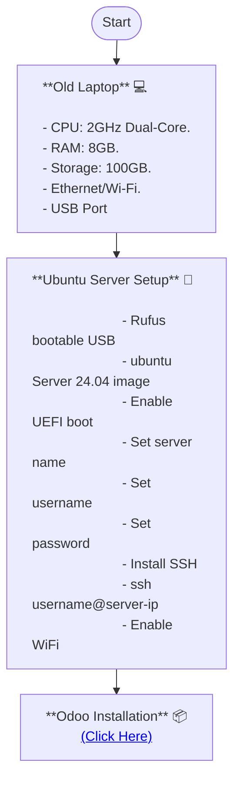

# IKYEASight

IKYEASight is a Business Intelligence (BI) and Data Analytics initiative focused on the end-to-end lifecycle of IKYEA businesses’ data.

```mermaid
%%{init: {'flowchart': {'rankSpacing': 30}}}%%
flowchart TB
    Start@{shape: pill}

    PC[**Old Laptop** 💻<br>
        - CPU: 2GHz Dual-Core.
        - RAM: 8GB.
        - Storage: 100GB.
        - Ethernet/Wi-Fi.
        - USB Port]

    Start --> PC
    linkStyle 0 stroke-width:1px,length:2px;
    style PC text-align:left

    Ubuntu_Installation[**Ubuntu Server Setup** 🐧<br>
                        - Rufus bootable USB
                        - ubuntu Server 24.04 image
                        - Enable UEFI boot
                        - Set server name
                        - Set username
                        - Set password
                        - Install SSH
                        - ssh username@server-ip
                        - Enable WiFi]
    PC --> Ubuntu_Installation
    style Ubuntu_Installation text-align:left

    Odoo_Installation["**Odoo Installation** 📦
    <a href='https://github.com/otalfredo8/ikyeasight/blob/main/docs/OdooInstallation.md'>(Click Here)</a>"]

    Ubuntu_Installation --> Odoo_Installation
```

## IKYEASight

https://ikyeasight.streamlit.app/

## Data Sources

- **Census Data**: Downloaded from [ACS 5-Year Estimates (2024)](https://data.census.gov/table/ACSST5Y2024.S1902?q=S1902)
  - Unzip and place CSV files in the `data/` folder before running scripts
