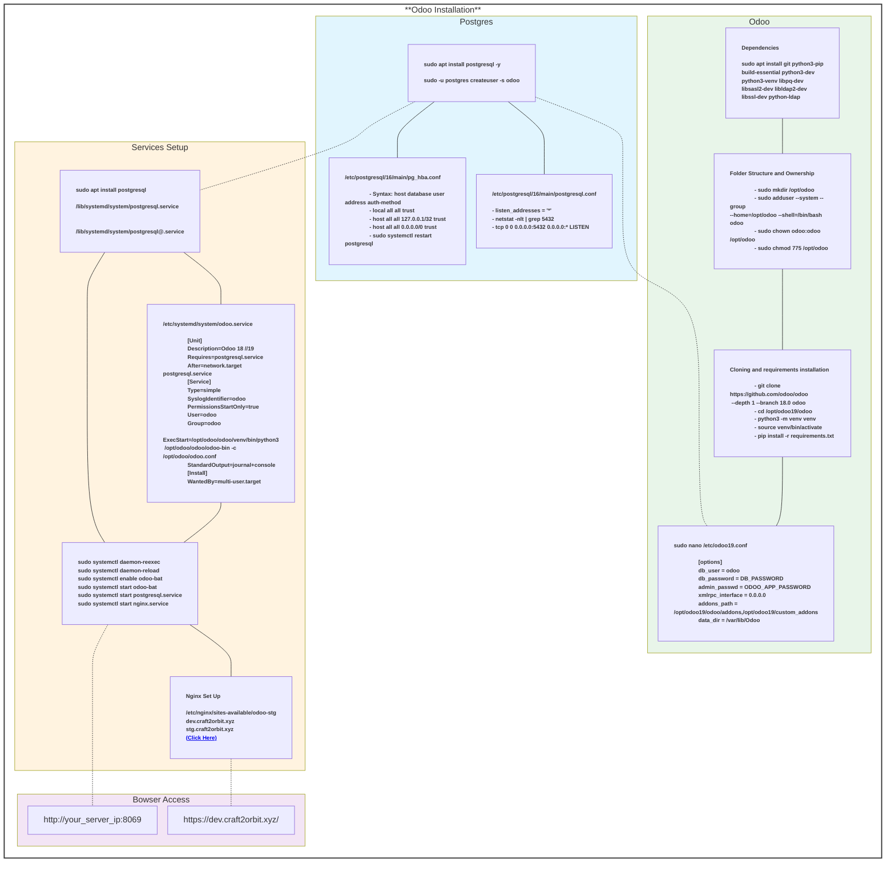

```mermaid
%%{init: {'flowchart': {'rankSpacing': 20, 'nodeSpacing':20}}}%%
flowchart TB
    subgraph GlobalContainer [**Odoo Installation**]
        direction TB

        subgraph Section1 [Postgres]
            pg_install["sudo apt install postgresql -y<br/>
                sudo -u postgres createuser -s odoo"]

            pg_auth["/etc/postgresql/16/main/pg_hba.conf <br/>
                - Syntax: host database user address auth-method
                - local all all trust
                - host all all 127.0.0.1/32 trust
                - host all all 0.0.0.0/0 trust
                - sudo systemctl restart postgresql"]

            pg_conf["/etc/postgresql/16/main/postgresql.conf<br/>
                - listen_addresses = '*'
                - netstat -nlt #124; grep 5432
                - tcp 0 0 0.0.0.0:5432 0.0.0.0:* LISTEN"]
        end
        subgraph Section3 ["Services Setup"]
            postgres["sudo apt install postgresql
                    /lib/systemd/system/postgresql.service<br/>
                    /lib/systemd/system/postgresql@.service"]

            odoo["/etc/systemd/system/odoo.service<br/>
                [Unit]
                Description=Odoo 18 //19
                Requires=postgresql.service
                After=network.target postgresql.service
                [Service]
                Type=simple
                SyslogIdentifier=odoo
                PermissionsStartOnly=true
                User=odoo
                Group=odoo
                ExecStart=/opt/odoo/odoo/venv/bin/python3<br/> /opt/odoo/odoo/odoo-bin -c /opt/odoo/odoo.conf
                StandardOutput=journal+console
                [Install]
                WantedBy=multi-user.target"]

            systemctl["sudo systemctl daemon-reexec
                    sudo systemctl daemon-reload
                    sudo systemctl enable odoo-bat
                    sudo systemctl start odoo-bat
                    sudo systemctl start postgresql.service
                    sudo systemctl start nginx.service"]

            nginx["Nginx Set Up<br/>
                /etc/nginx/sites-available/odoo-stg
                dev.craft2orbit.xyz
                stg.craft2orbit.xyz
                <a href='./dev_nginx_dual_server_reverse_proxy.md'>(Click Here)</a>"]

        end

        subgraph Section2 [Odoo]
            odoo_install["Dependencies<br/>
                sudo apt install git python3-pip
                build-essential python3-dev
                python3-venv libpq-dev
                libsasl2-dev libldap2-dev
                libssl-dev python-ldap"]

            odoo_folderStructure["Folder Structure and Ownership<br/>
                - sudo mkdir /opt/odoo
                - sudo adduser --system --group <br/>--home=/opt/odoo --shell=/bin/bash odoo
                - sudo chown odoo:odoo /opt/odoo
                - sudo chmod 775 /opt/odoo"]

            odoo_clonigAndRequirements["Cloning and requirements installation<br/>
                - git clone https://github.com/odoo/odoo<br/> --depth 1 --branch 18.0 odoo
                - cd /opt/odoo19/odoo
                - python3 -m venv venv
                - source venv/bin/activate
                - pip install -r requirements.txt"]

            odoo_conf["sudo nano /etc/odoo19.conf<br/>
                [options]
                db_user = odoo
                db_password = DB_PASSWORD
                admin_passwd = ODOO_APP_PASSWORD
                xmlrpc_interface = 0.0.0.0
                addons_path = /opt/odoo19/odoo/addons,/opt/odoo19/custom_addons
                data_dir = /var/lib/Odoo"]
        end

        subgraph Section4 ["Bowser Access"]
            local["http://your_server_ip:8069"]
            public["https://dev.craft2orbit.xyz/"]
        end
    end

    %% %% Global Styling to differentiate
    style GlobalContainer fill:none,stroke:#333,stroke-width:2px
    style Section1 fill:#e1f5fe;
    style Section2 fill:#e8f5e9;
    style Section3 fill:#fff3e0;
    style Section4 fill:#f3e5f5;

    pg_install -.- postgres
    pg_install --- pg_auth
    pg_install --- pg_conf
    pg_install -.- odoo_conf
    postgres --- odoo
    postgres --- systemctl
    odoo --- systemctl
    systemctl -.- local
    systemctl --- nginx
    odoo_install --- odoo_folderStructure
    odoo_folderStructure --- odoo_clonigAndRequirements
    odoo_clonigAndRequirements --- odoo_conf

    nginx -.- public

    %% %% %% 1. SHRINK BOXES: Reduce padding inside the nodes
    classDef smallNode padding:5px,font-size:10.5px,font-weight:bold,text-align:left;
    class pg_install,pg_auth,pg_conf,odoo_install,odoo_folderStructure,odoo_clonigAndRequirements,odoo_conf,postgres,odoo,nginx,systemctl,UI,UI2 smallNode
```
