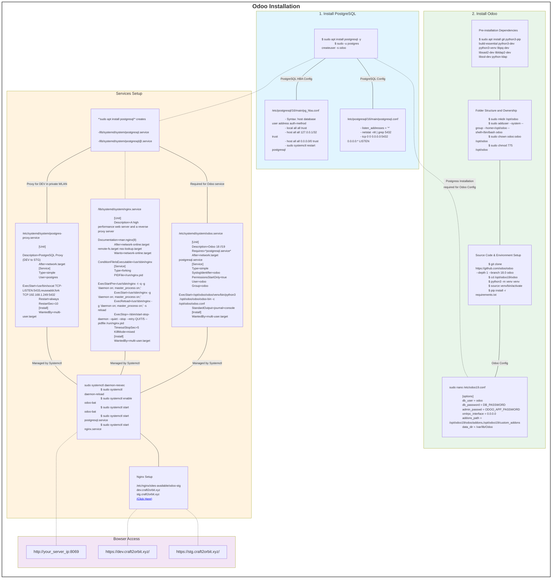

```mermaid
%%{init: {'flowchart': {'rankSpacing': 20, 'nodeSpacing':20, 'padding': '60'}}%%
flowchart TB
    subgraph GlobalContainer [<span style="font-size: 24px; font-weight: bold">Odoo Installation</span>]
        direction TB

        subgraph Section1 [1. Install PostgreSQL]
            pg_install["
                $ sudo apt install postgresql -y
                $ sudo -u postgres createuser -s odoo
                "]

            pg_auth["/etc/postgresql/16/main/pg_hba.conf <br/>
                - Syntax: host database user address auth-method
                - local all all trust
                - host all all 127.0.0.1/32 trust
                - host all all 0.0.0.0/0 trust
                - sudo systemctl restart postgresql"]

            pg_conf["/etc/postgresql/16/main/postgresql.conf<br/>
                - listen_addresses = '*'
                - netstat -nlt #124; grep 5432
                - tcp 0 0 0.0.0.0:5432 0.0.0.0:* LISTEN"]
        end
        subgraph Section3 ["Services Setup"]
            postgres["*'sudo apt install postgresql'* creates<br/>
                    -/lib/systemd/system/postgresql.service
                    -/lib/systemd/system/postgresql@.service"]

            pg-proxy_service["/etc/systemd/system/postgres-proxy.service<br/>
                    [Unit]
                    Description=PostgreSQL Proxy (DEV to STG)
                    After=network.target
                    [Service]
                    Type=simple
                    User=postgres
                    ExecStart=/usr/bin/socat TCP-LISTEN:5433,reuseaddr,fork TCP:192.168.1.249:5432
                    Restart=always
                    RestartSec=10
                    [Install]
                    WantedBy=multi-user.target"]

            nginx_service["/lib/systemd/system/nginx.service<br/>
                    [Unit]
                    Description=A high performance web server and a reverse proxy server
                    Documentation=man:nginx(8)
                    After=network-online.target remote-fs.target nss-lookup.target
                    Wants=network-online.target
                    ConditionFileIsExecutable=/usr/sbin/nginx
                    [Service]
                    Type=forking
                    PIDFile=/run/nginx.pid
                    ExecStartPre=/usr/sbin/nginx -t -q -g 'daemon on; master_process on;'
                    ExecStart=/usr/sbin/nginx -g 'daemon on; master_process on;'
                    ExecReload=/usr/sbin/nginx -g 'daemon on; master_process on;' -s reload
                    ExecStop=-/sbin/start-stop-daemon --quiet --stop --retry QUIT/5 --pidfile /run/nginx.pid
                    TimeoutStopSec=5
                    KillMode=mixed
                    [Install]
                    WantedBy=multi-user.target"]

            odoo["/etc/systemd/system/odoo.service<br/>
                [Unit]
                Description=Odoo 18 //19
                Requires=*postgresql.service*
                After=network.target postgresql.service
                [Service]
                Type=simple
                SyslogIdentifier=odoo
                PermissionsStartOnly=true
                User=odoo
                Group=odoo
                ExecStart=/opt/odoo/odoo/venv/bin/python3<br/> /opt/odoo/odoo/odoo-bin -c /opt/odoo/odoo.conf
                StandardOutput=journal+console
                [Install]
                WantedBy=multi-user.target"]

            systemctl["sudo systemctl daemon-reexec
                    $ sudo systemctl daemon-reload
                    $ sudo systemctl enable odoo-bat
                    $ sudo systemctl start odoo-bat
                    $ sudo systemctl start postgresql.service
                    $ sudo systemctl start nginx.service"]

            nginx["Nginx Setup<br/>
                /etc/nginx/sites-available/odoo-stg
                dev.craft2orbit.xyz
                stg.craft2orbit.xyz
                <a href='https://github.com/otalfredo8/ikyeasight/blob/main/docs/dev_nginx_dual_server_reverse_proxy.md'>(Click Here)</a>"]

        end

        subgraph Section2 [2. Install Odoo]
            odoo_install["Pre-installation Dependencies<br/>
                $ sudo apt install git python3-pip
                build-essential python3-dev
                python3-venv libpq-dev
                libsasl2-dev libldap2-dev
                libssl-dev python-ldap"]

            odoo_folderStructure["Folder Structure and Ownership<br/>
                $ sudo mkdir /opt/odoo
                $ sudo adduser --system --group --home=/opt/odoo --shell=/bin/bash odoo
                $ sudo chown odoo:odoo /opt/odoo
                $ sudo chmod 775 /opt/odoo"]

            odoo_clonigAndRequirements["Source Code & Environment Setup<br/>
                $ git clone https://github.com/odoo/odoo<br/> --depth 1 --branch 18.0 odoo
                $ cd /opt/odoo19/odoo
                $ python3 -m venv venv
                $ source venv/bin/activate
                $ pip install -r requirements.txt"]

            odoo_conf["sudo nano /etc/odoo19.conf<br/>
                [options]
                db_user = odoo
                db_password = DB_PASSWORD
                admin_passwd = ODOO_APP_PASSWORD
                xmlrpc_interface = 0.0.0.0
                addons_path = /opt/odoo19/odoo/addons,/opt/odoo19/custom_addons
                data_dir = /var/lib/Odoo"]
        end

        subgraph Section4 ["Bowser Access"]
            local["http://your_server_ip:8069"]
            public_dev["https://dev.craft2orbit.xyz/"]
            public_stg["https://stg.craft2orbit.xyz/"]
        end
    end

    %% %% Global Styling to differentiate
    style GlobalContainer fill:none,stroke:#333,stroke-width:2px
    style Section1 fill:#e1f5fe;
    style Section2 fill:#e8f5e9;
    style Section3 fill:#fff3e0;
    style Section4 fill:#f3e5f5;

    pg_install -.- postgres
    postgres --- |<span style="font-size: 12px;">Proxy for DEV in private WLAN</span>| pg-proxy_service
    pg_install --- |<span style="font-size: 12px;">PostgreSQL HBA Config</span>| pg_auth
    pg_install --- |<span style="font-size: 12px;">PostgreSQL Config</span>| pg_conf
    pg_install -.- |<span style="font-size: 12px;">Postgress Installation<br/>required for Odoo Config</span> | odoo_conf
    postgres --- |<span style="font-size: 12px;">Required for Odoo service</span>| odoo
    pg-proxy_service --- |<span style="font-size: 12px;">Managed by Systemctl</span>| systemctl
    postgres -.- nginx_service
    nginx_service --- |<span style="font-size: 12px;">Managed by Systemctl</span>|systemctl
    odoo --- |<span style="font-size: 12px;">Managed by Systemctl</span>|systemctl
    systemctl -.- local
    systemctl --- nginx
    odoo_install --- odoo_folderStructure
    odoo_folderStructure --- odoo_clonigAndRequirements
    odoo_clonigAndRequirements --- |<span style="font-size: 12px;">Odoo Config</span>| odoo_conf

    nginx -.- public_dev
    nginx -.- public_stg

    %% %% %% 1. SHRINK BOXES: Reduce padding inside the nodes
    classDef smallNode padding:5px,font-size:12px,text-align:left;
    classDef wideNode padding:10px,padding-left:30px,padding-right:30px,font-size:12px,text-align:left;
    class pg_install,pg_auth,pg_conf,pg-proxy_service,nginx_service,odoo_install,odoo_folderStructure,odoo_clonigAndRequirements,odoo_conf,postgres,odoo,nginx,systemctl,UI,UI2 smallNode
    class odoo_folderStructure wideNode
```
