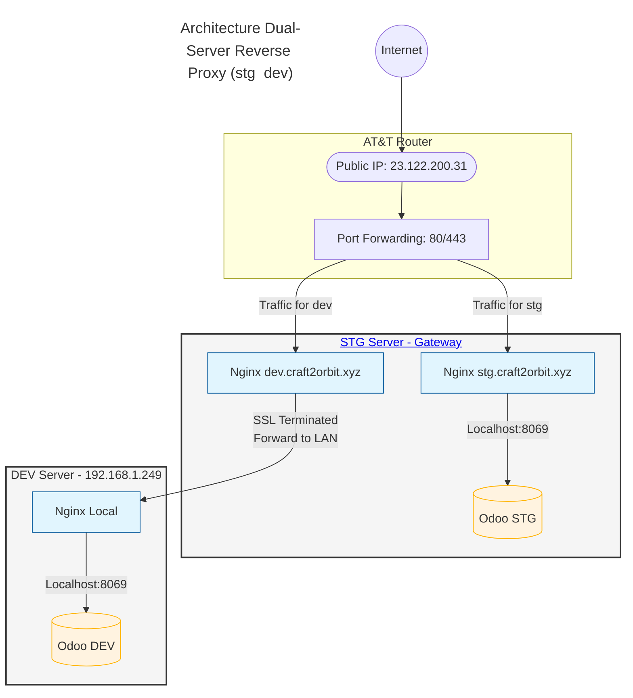

```mermaid
flowchart TB
    title["Architecture Dual-Server Reverse Proxy (stg  dev)"]
    style title fill:none,stroke:none,font-size:20px

    internet((Internet))

    subgraph Router [AT&T Router]
        direction TB
        public_ip([Public IP: 23.122.200.31])
        nat[Port Forwarding: 80/443]
    end

    subgraph stg_server ["<a href='https://github.com/otalfredo8/ikyeasight'>STG Server - Gateway</a>"]
        direction TB
        nginx_stg[Nginx stg.craft2orbit.xyz]
        nginx_dev_proxy[Nginx dev.craft2orbit.xyz]
        odoo_stg[(Odoo STG)]
    end

    subgraph dev_server [DEV Server - 192.168.1.249]
        direction TB
        nginx_local[Nginx Local]
        odoo_dev[(Odoo DEV)]
    end

    %% Traffic Flow
    internet --> public_ip
    public_ip --> nat

    nat -->|Traffic for stg| nginx_stg
    nat -->|Traffic for dev| nginx_dev_proxy

    nginx_stg -->|Localhost:8069| odoo_stg

    %% Proxying to Dev
    nginx_dev_proxy -- "SSL Terminated<br/>Forward to LAN" --> nginx_local
    nginx_local -->|Localhost:8069| odoo_dev

    %% Styling
    classDef server fill:#f5f5f5,stroke:#333,stroke-width:2px;
    classDef proxy fill:#e1f5fe,stroke:#01579b;
    classDef db fill:#fff3e0,stroke:#ffb300;

    class stg_server,dev_server server;
    class nginx_stg,nginx_dev_proxy,nginx_local proxy;
    class odoo_stg,odoo_dev db;
```
