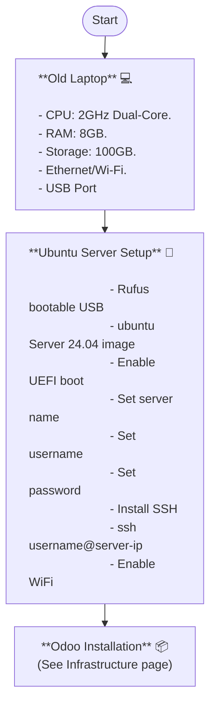

# IKYEASight

**IKYEASight** is a Business Intelligence (BI) and Data Analytics initiative focused on the end-to-end lifecycle of IKYEA businesses' data. It connects live Odoo ERP databases, geocodes partner addresses, and visualizes them on an interactive map dashboard.

🚀 **Live App:** [ikyeasight.streamlit.app](https://ikyeasight.streamlit.app/)

---

## What It Does

IKYEASight pulls partner (customer/vendor) records from three IKYEA brand databases in real time, geocodes their addresses using the OpenStreetMap Nominatim API, and renders an interactive, clustered world map so the team can instantly see the geographic distribution of all IKYEA partners.

| Brand | Color on Map |
|---|---|
| I-Clothing | 🔵 Blue |
| I-Furniture | 🟢 Green |
| I-Restaurant | 🟠 Orange |

---

## System Overview

---

## Pages

- [Getting Started](getting-started) — Installation, configuration, and first run
- [Architecture](architecture) — MVC design, data flow, and component overview
- [API Reference](api-reference) — Module and class documentation
- [Infrastructure](infrastructure) — Server setup, Nginx, and Odoo installation

---

## Data Sources

- **U.S. Census Bureau — ACS 5-Year Estimates (2024)**
  - Source: [data.census.gov](https://data.census.gov/table/ACSST5Y2024.S1101?g=860XX00US65054)
  - File: `ACSST5Y2024.S1902-Data.csv` — household income, family income, income by demographics
  - Place the file in the `data/` folder before running analysis
