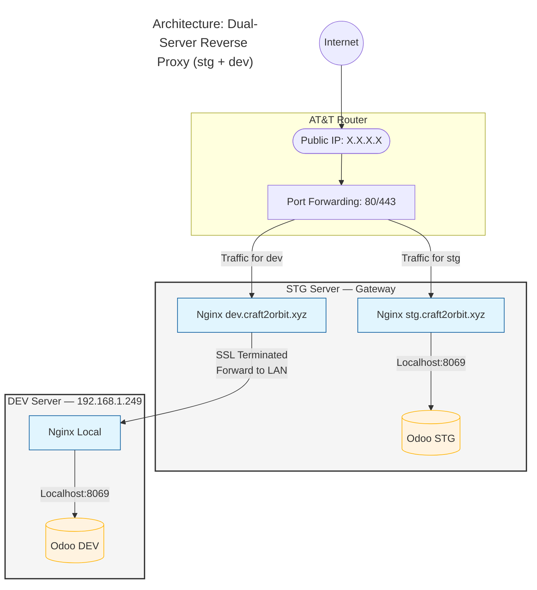
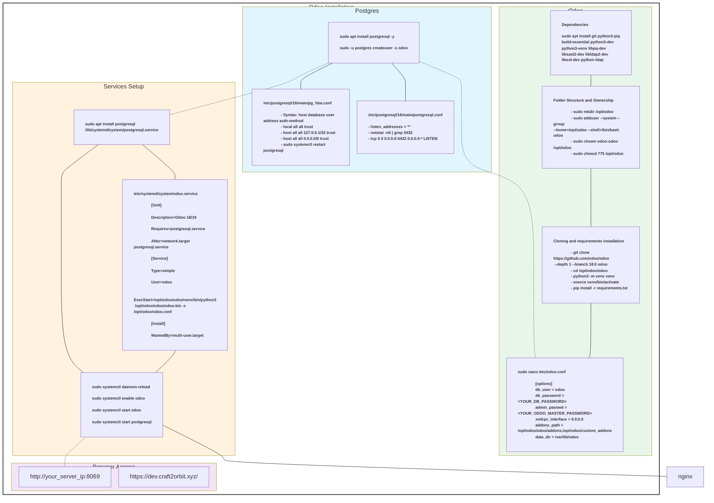

# Infrastructure

IKYEASight runs on two self-hosted Ubuntu Server machines connected via a local network, with Nginx acting as a dual reverse proxy to expose both Odoo instances to the internet.

---

## Hardware

| Server | Role | Specs |
|---|---|---|
| Old Laptop | STG (Gateway) + DEV Proxy | 2GHz Dual-Core, 8GB RAM, 100GB storage |
| Local Machine | DEV Server (192.168.1.249) | — |

---

## Network Topology

---

## Ubuntu Server Setup

1. Create a bootable USB with Rufus using the Ubuntu Server 24.04 image
2. Enable UEFI boot and install with:
   - Server hostname
   - Username and password
   - OpenSSH enabled
3. Connect via SSH: `ssh username@server-ip`
4. Enable Wi-Fi if needed

---

## Odoo Installation

---

## Nginx Configuration

See the full dual-server Nginx reverse proxy configuration in [dev_nginx_dual_server_reverse_proxy.md](https://github.com/otalfredo8/ikyeasight/blob/main/docs/dev_nginx_dual_server_reverse_proxy.md).

**Key domains:**
- `stg.craft2orbit.xyz` → STG Odoo (localhost:8069 on gateway server)
- `dev.craft2orbit.xyz` → DEV Odoo (192.168.1.249:8069 via proxy)
